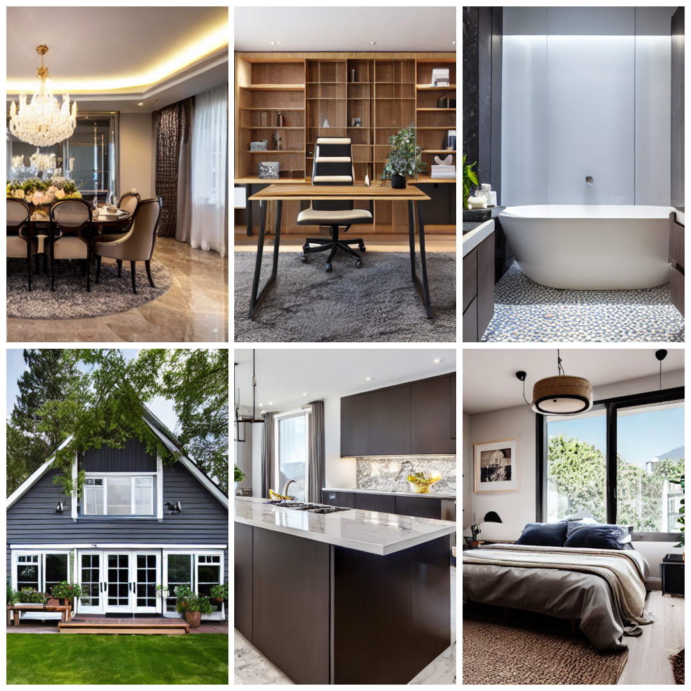

markdown
# 🏠 SafaHomes AI Interior Design Generator

<div align="center">
  
  <br>
  <em>🎨 Real AI-generated interior and exterior designs created by SafaHomes AI</em>
</div>

## ✨ **What is SafaHomes AI?**

SafaHomes AI is a cutting-edge AI-powered platform that transforms text descriptions into professional-quality interior and exterior design visualizations. Using advanced Stable Diffusion technology, it helps architects, interior designers, and homeowners visualize their design concepts instantly.

## 🚀 **Quick Start**

### **Backend Setup (AI Server)**
```bash
cd backend
python -m venv venv
# Windows: venv\Scripts\activate
# Mac/Linux: source venv/bin/activate
pip install -r requirements.txt
uvicorn main:app --reload --host 0.0.0.0 --port 8000
Frontend Setup (Web Interface)
bash
cd frontend
npm install
npm start
🎯 Key Features
1. AI-Powered Design Generation
Text-to-Image: Convert any design idea into visual concepts

Smart Prompt Enhancement: AI improves your descriptions automatically

Multiple Styles: Modern, Traditional, Minimalist, Scandinavian, Industrial

High Resolution: 512×512 pixels with professional quality

2. User-Friendly Interface
Intuitive Prompt Input: Type your design ideas naturally

Example Library: 10+ pre-designed prompts to get started

Real-time Preview: Watch your design generate live

History Tracking: Save and revisit all your designs

3. Professional Results
Architectural Accuracy: AI understands spatial design principles

Material Realism: Wood, marble, glass, concrete textures

Lighting Control: Natural light, ambient, spotlight effects

Furniture Layout: Intelligent space planning

🖼️ Image Generation Showcase
<div align="center">  <p><strong>Examples of designs generated by SafaHomes AI</strong></p> </div>
Example Prompts & Results
Design Type	Sample Prompt	AI Enhancement
Modern Living Room	"Minimalist living room with white walls"	Adds wooden floors, modern furniture, natural lighting
Luxury Kitchen	"Kitchen with marble countertops"	Adds island, pendant lights, modern appliances
Scandinavian Bedroom	"Cozy bedroom with natural light"	Adds wooden elements, soft textiles, minimalist decor
Modern Exterior	"House with large windows"	Adds garden, architectural details, landscaping
🛠️ How It Works
Step 1: Enter Your Design Idea
Type a description of your desired space:

text
"Modern minimalist living room with white walls and wooden floors"
Step 2: AI Processing
The system automatically enhances your prompt:

python
# AI adds professional details
enhanced_prompt = "Modern minimalist living room with white walls and wooden floors, 
                   high quality, detailed, professional interior design, 
                   4k, realistic, architecture, natural lighting"
Step 3: Generate Image
AI processes the enhanced prompt

Generates high-quality design in 30-60 seconds

Real-time progress display

Step 4: View & Download
Preview the generated design

Download as PNG file

Save to your history

📊 Technical Architecture
text
User Input → Frontend UI → Backend API → AI Model → Generated Image
    ↓           ↓           ↓           ↓           ↓
Text Prompt → React App → FastAPI → Stable Diffusion → PNG Output
Backend Stack
Framework: FastAPI (Python)

AI Model: Stable Diffusion v1.5

Image Processing: Pillow, OpenCV

API Documentation: Swagger UI

Frontend Stack
Framework: React 18

UI Library: Material-UI

HTTP Client: Axios

Styling: CSS3 with modern animations

🔧 API Endpoints
Generate Image
http
POST http://localhost:8000/generate
Content-Type: application/json

{
    "prompt": "Modern living room with floor-to-ceiling windows",
    "user_id": "designer_001"
}
Response:

json
{
    "success": true,
    "image": "data:image/png;base64,...",
    "prompt": "Modern living room with floor-to-ceiling windows",
    "timestamp": "2024-01-01T12:00:00"
}
Get Generation History
http
GET http://localhost:8000/history?user_id=designer_001
System Health Check
http
GET http://localhost:8000/health
🎨 Best Practices for Design Generation
✅ Do's
Be Specific: "Modern living room with leather sofa and coffee table"

Include Materials: "Kitchen with marble countertops and wooden cabinets"

Specify Lighting: "Bedroom with natural morning light"

Mention Style: "Scandinavian-style living room"

Add Colors: "Blue accent wall in minimalist bedroom"

❌ Don'ts
Too Vague: "Nice room"

Generic: "Beautiful design"

Brand Names: "IKEA furniture" (AI doesn't recognize brands)

Overly Complex: Multiple conflicting styles in one prompt

Pro Tips
Start Simple: Begin with basic descriptions, then add details

Use Adjectives: "Cozy", "Spacious", "Bright", "Modern"

Include Elements: "Fireplace", "Bookshelf", "Plants", "Artwork"

Specify Era: "Mid-century modern", "Contemporary", "Traditional"

📁 Project Structure
text
safa-homes-ai/
├── backend/                    # AI Image Generation Server
│   ├── main.py               # FastAPI server with AI model
│   ├── requirements.txt      # Python dependencies
│   └── README.md            # Backend documentation
│
├── frontend/                 # React Web Interface
│   ├── public/              # Static files
│   ├── src/                 # React source code
│   │   ├── components/      # UI Components
│   │   │   ├── ImageGenerator.jsx  # Main generation interface
│   │   │   ├── History.jsx         # Design history
│   │   │   └── Navbar.jsx          # Navigation
│   │   ├── App.jsx          # Main application
│   │   ├── App.css          # Styles
│   │   └── index.jsx        # Entry point
│   └── package.json         # Frontend dependencies
│
└── README.md                # This file
⚙️ System Requirements
Minimum Requirements
CPU: Intel i5 or equivalent (4+ cores)

RAM: 8GB minimum (16GB recommended)

Storage: 10GB free space

Python: 3.8 or higher

Node.js: 16.x or higher

Recommended (For Best Performance)
GPU: NVIDIA GPU with 8GB+ VRAM

RAM: 16GB or higher

Storage: SSD with 20GB free space

Internet: Stable connection for model download